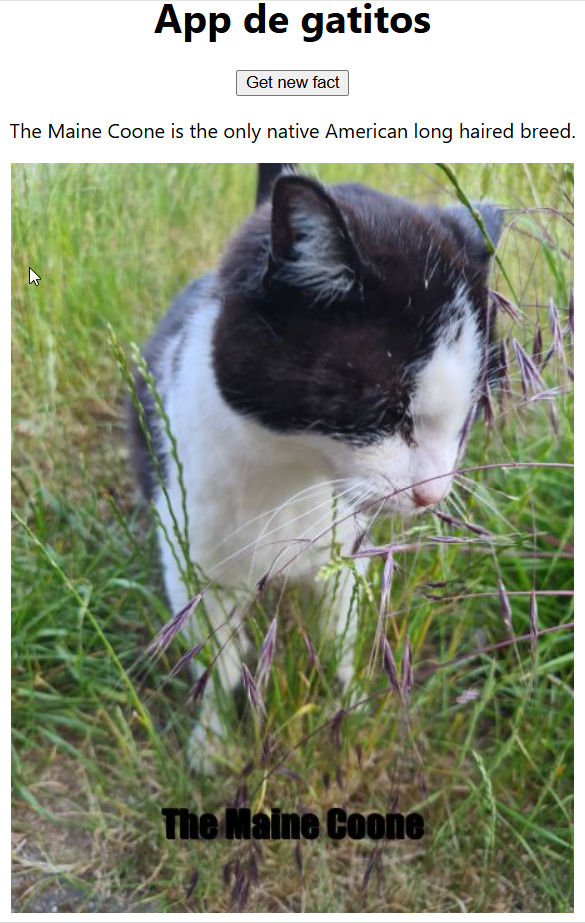

# Prueba técnica #1

Esta aplicación fue desarrollada siguiendo el tutorial de **[Midudev](https://www.youtube.com/@midulive)** en YouTube.

Puedes ver el tutorial completo aquí: [Link al tutorial](https://www.youtube.com/watch?v=XYpadB4VadY&list=PLUofhDIg_38q4D0xNWp7FEHOTcZhjWJ29&index=3)

## Descripción

Prueba técnica donde se seleccionan las primeras tres palabras que aparecen aleatoriamente de la [url](https://catfact.ninja/fact) y con ella se busca una imagen de un gatito en la siguiente [url](https://cataas.com/cat/says/${threeFirstWords}?size=50&color=red&json=true) que contenga esas tres palabras y luego se renderizará, como se muestra en la siguiente imagen:

